# 5mins-快車-

5mins is a real-time dispatch app designed specifically for Taiwan’s popular “fleet” (car team) culture. It revolutionizes the traditional, inefficient process of dispatching and receiving orders via text messages by automating everything—saving up to 90% of the time. 5mins is already in use by real fleet companies, delivering significant improvements in operational efficiency and user experience.

---

## Technologies
- **Android (Java)**
- **Firebase Realtime Database** (real-time data sync)
- **Google Maps API / Google Places API** (location autocomplete, geolocation)

---

## Highlights

### Design and Architecture
+ **Tailored for Taiwan’s fleet culture:** Simple, intuitive multi-tab interface designed for real-world driver and dispatcher needs.
+ **Real-time cloud data sync:** All orders, user statuses, and locations are instantly synchronized via Firebase Realtime Database.
+ **Deep Google Maps/Places API integration:** Location autocomplete, geocoding, and map navigation streamline the dispatch and order process.

### Google Maps API & Smart Location Handling
+ **Location Autocomplete:** When creating a new order, users get instant Google Places suggestions and precise coordinates.
+ **Geolocation Calculation:** The system automatically calculates the distance between new orders and all “on-duty” drivers to ensure the most efficient dispatch.
+ **Map Navigation:** Drivers can launch Google Maps navigation directly from order details.

### Firebase Data Sync & Real-Time Interaction
+ **Instant Data Push:** All orders, user statuses, and locations are stored in Firebase and reflected in real time across all clients.
+ **User Status Monitoring:** Drivers’ GPS locations are uploaded automatically when on duty, allowing real-time tracking by dispatchers.
+ **Secure Logout:** Logging out automatically sets the status to “offline” and clears the location for data accuracy and privacy.

### Smart “Priority Dispatch” Feature
+ **Auto-assign Nearest Driver:** When a new order is created, the system calculates the distance to all “on-duty” drivers and gives priority to the nearest one.
+ **10-Second Priority Window:** The assigned driver has a 10-second exclusive window to accept the order. If not accepted, the order becomes available to others—ensuring both efficiency and fairness.
+ **Drastically Reduces Manual Communication:** No more manual dispatching via LINE or phone calls—everything is automated, saving time and effort.

---

## User Experience
+ **Bottom Navigation:** Quick switching between “Home” (status/orders), “Orders” (history/active), and “Profile” (user info, logout).
+ **Interactive UI:** Location autocomplete, time picker, confirmation dialogs, and more for a smooth experience.
+ **Localization:** Default interface in Traditional Chinese, with location autocomplete optimized for Taiwan.

---

## Between Users
+ **Real-Time Collaboration:** Drivers, dispatchers, and admins all see the latest orders and statuses instantly, boosting teamwork.
+ **Profile Center:** View personal status, logout, and manage accounts—all in one place.

---

## Security
+ **Sensitive Info Masked:** All keys and API credentials are replaced with placeholders—safe for public sharing.
+ **Data Privacy:** Logging out clears location and status, protecting user privacy.

---

## Preview -Admin-
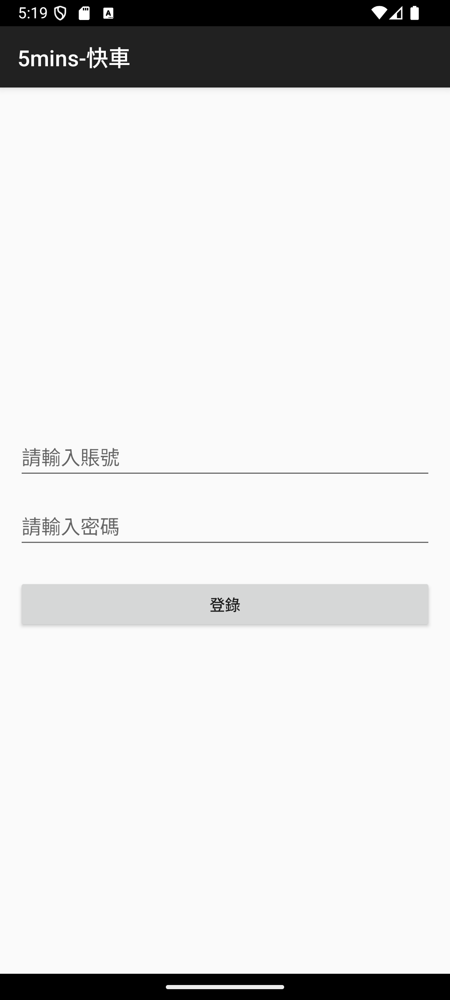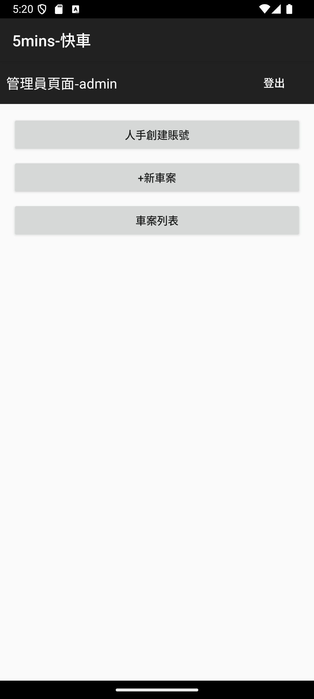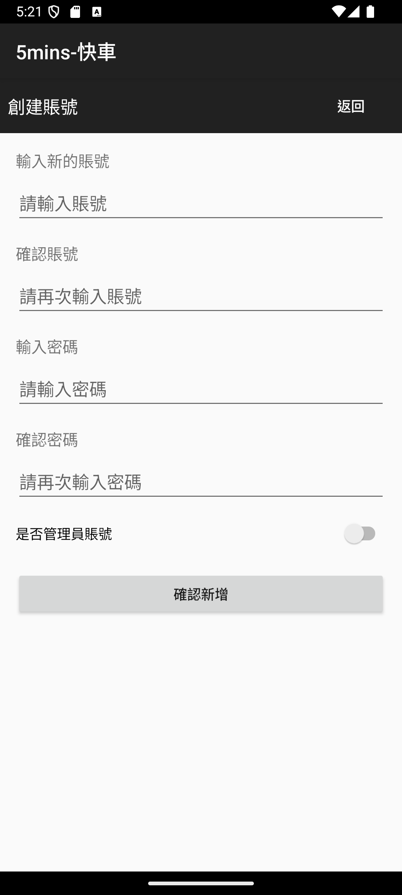
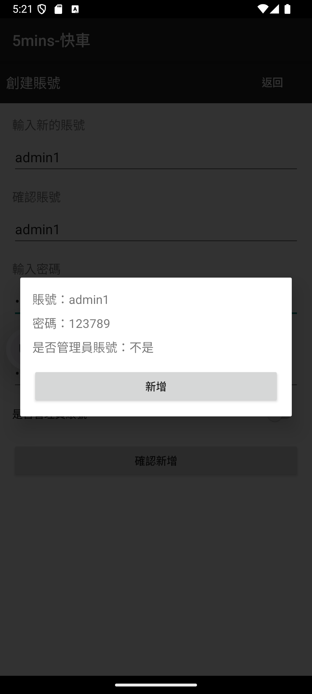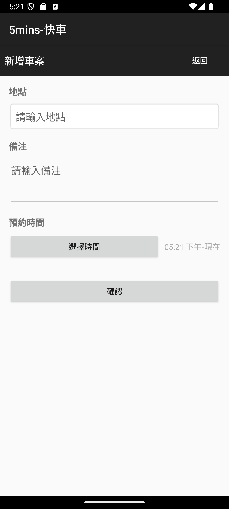
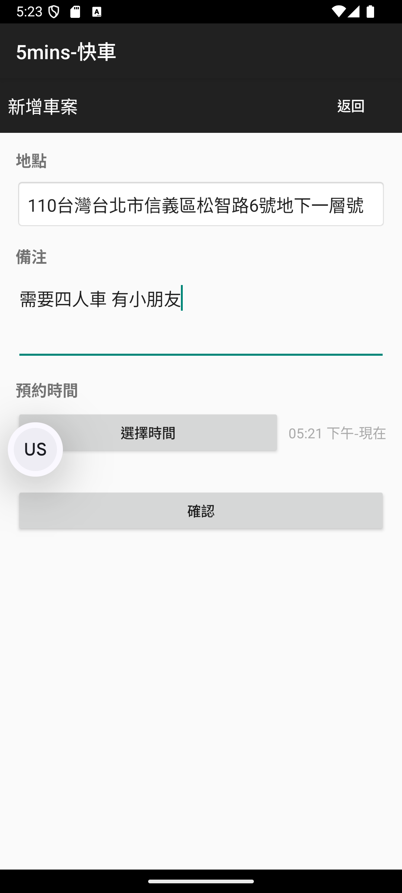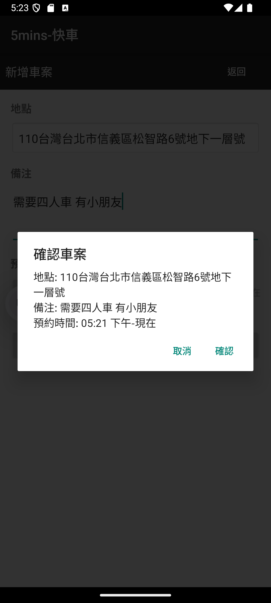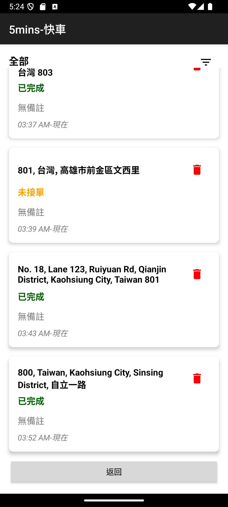
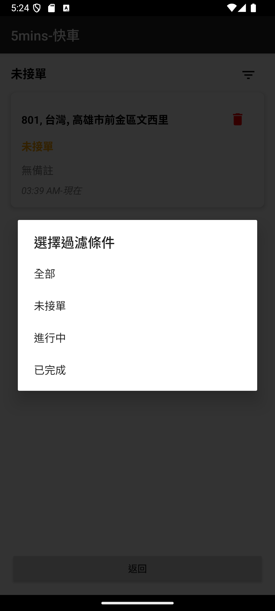

## Preview -User-
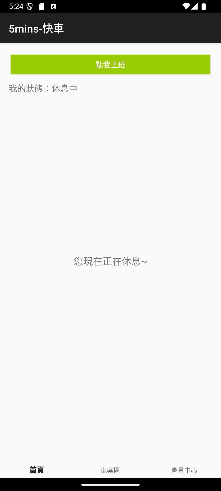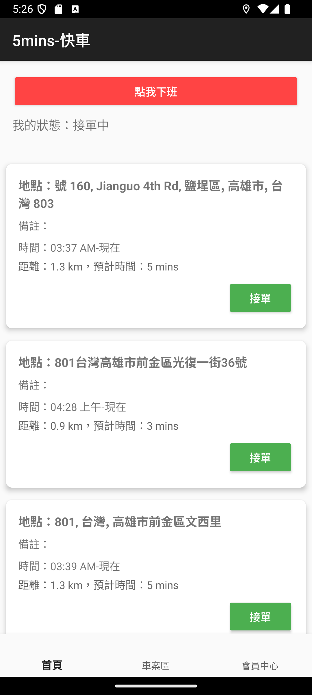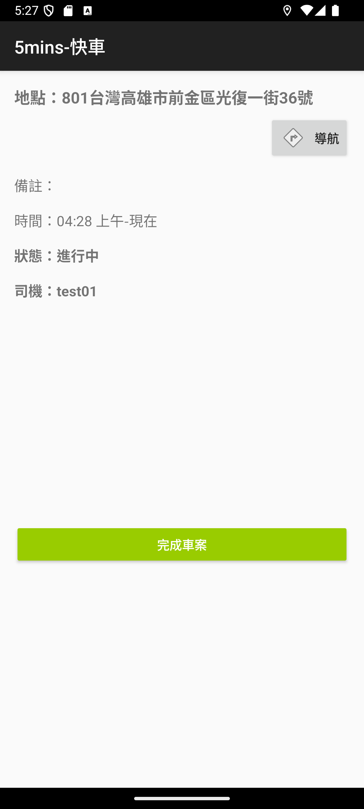
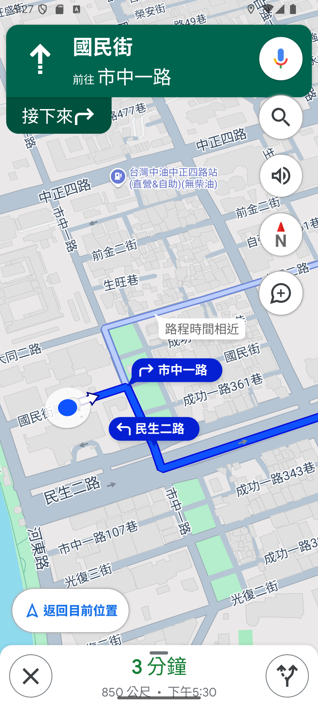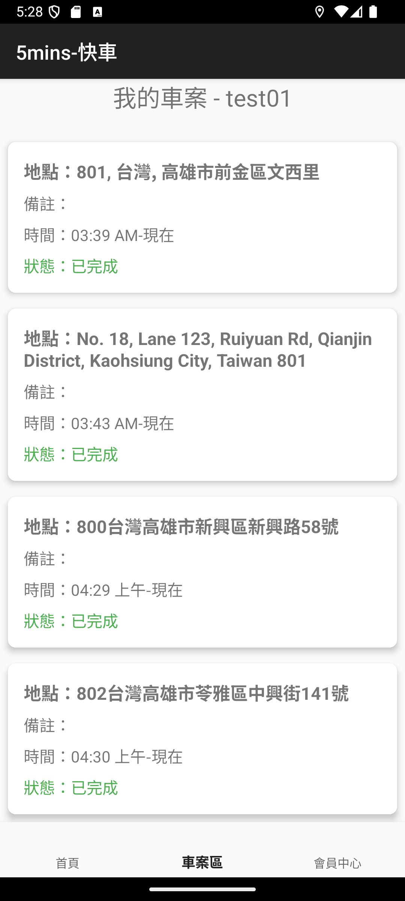
